# 🥋 格闘技掲示板プロジェクト

Laravelとmixhostを利用し、大会ごと・選手ごとのスレッド型掲示板を、匿名投稿機能付きで実現するプロジェクトです。
Google認証は後回しにし、まずはミニマムな機能での開発・デプロイを目指します。

---

## ER図

```plantuml
@startuml
!theme plain

entity User {
    + id: bigIncrements
    --
    name: string
    email: string
    email_verified_at: timestamp
    password: string
    remember_token: string
    created_at: timestamp
    updated_at: timestamp
}

entity Event {
    + id: bigIncrements
    --
    name: string
    created_at: timestamp
    updated_at: timestamp
}

entity Fighter {
    + id: bigIncrements
    --
    name: string
    created_at: timestamp
    updated_at: timestamp
}

entity Thread {
    + id: bigIncrements
    --
    event_id: foreignId <<nullable>>
    fighter_id: foreignId <<nullable>>
    title: string
    created_at: timestamp
    updated_at: timestamp
}

entity Post {
    + id: bigIncrements
    --
    thread_id: foreignId
    message: text
    name: string <<nullable>>
    created_at: timestamp
    updated_at: timestamp
}

User ||--o{ Thread : "" (将来の関連性、現在は不使用)
Event ||--o{ Thread : "1"
Fighter ||--o{ Thread : "1"
Thread ||--o{ Post : "1"

@enduml
```

